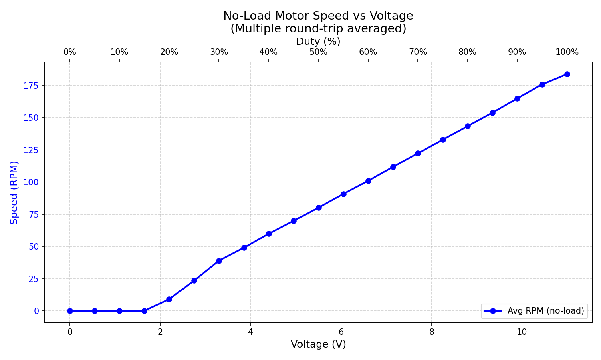
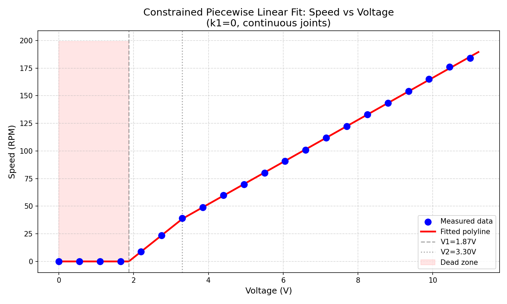

# 直流电机转速闭环控制系统

基于 **STM32F103C8T6** + **Rust Embassy** 框架的直流电机前馈-反馈复合转速闭环控制项目。

## 系统功能

- **编码器测速**：TIM1 QEI 正交编码器输入，M/T 法浮点转速计算
- **前馈-反馈复合控制**：
  - **前馈**：空载分段线性逆模型（电压→转速）直接查表给出基础占空比
  - **反馈**：位置式 PI（D=0），支持 P/I 在线调参、积分限幅、输出限幅、积分分离、条件积分抗饱和
- **PWM 电机驱动**：TIM2 驱动 L298N，20kHz PWM，支持正反转
- **OLED 显示**：SH1106 1.3寸屏，I2C+局部刷新，实时显示转速与占空比
- **矩阵键盘**：4键输入，支持速度设定、PI 参数调节、阶跃保持模式

## 硬件连接

| 功能 | STM32 引脚 | 外设引脚 |
|------|-----------|---------|
| PWM IN1 | PB10 (TIM2 CH3) | L298N IN1 |
| PWM IN2 | PB11 (TIM2 CH4) | L298N IN2 |
| ENA 使能 | PA7 | L298N ENA |
| 编码器 A 相 | PA8 (TIM1 CH1) | 编码器 A |
| 编码器 B 相 | PA9 (TIM1 CH2) | 编码器 B |
| OLED SCL | PB8 (I2C1) | OLED SCL |
| OLED SDA | PB9 (I2C1) | OLED SDA |
| 键盘 C1~C4 | PA3~PA6 | 矩阵键盘列线 |
| 调试串口 TX | PB6 | DAPLINK RX |
| 调试串口 RX | PB7 | DAPLINK TX |

## 电机参数

- 12V 减速电机，空载 201 RPM，负载 168 RPM
- 减速比 21:1，编码器 11 PPR × 4 倍频 = **924 counts/rev**

## 空载转速-电压特性与逆模型

通过 `test_speed_voltage` 自动扫描占空比并采集稳态转速，经上位机 `plot_speed_voltage.py` 处理得到空载标定数据 `speed_voltage.csv`：



使用带约束的分段线性拟合（`fit_piecewise_linear.py`）得到空载逆模型参数，用于前馈控制器：



拟合参数：
- $V_1 = 1.870\ \text{V}$，$V_2 = 3.300\ \text{V}$
- $K_2 = 26.9481\ \text{rpm/V}$，$K_3 = 19.0659\ \text{rpm/V}$

逆模型（rpm → 电压）：
$$
V_{\text{ff}}(\omega^*) = \begin{cases}
0, & |\omega^*| \le 0 \\[6pt]
V_1 + \dfrac{|\omega^*|}{K_2}, & 0 < |\omega^*| \le 38.54 \\[10pt]
V_2 + \dfrac{|\omega^*| - 38.54}{K_3}, & |\omega^*| > 38.54
\end{cases}
$$

该逆模型本身已包含死区效应（$V \le V_1$ 时转速为 0），前馈不再额外叠加固定死区补偿。

## 控制器架构

### 前馈控制器
根据目标转速通过空载逆模型查表得到基础电压，再按 $11\ \text{V} \rightarrow 100\%$ 占空比转换为前馈占空比：
$$u_{\text{ff}} = \dfrac{V_{\text{ff}}}{11} \times 100\%$$

### 反馈控制器（PI）
$$u_{\text{fb}} = K_p e + K_i \int e\,\mathrm{d}t$$

抗积分饱和机制：
- **积分限幅**：积分项单独限制在 $[-30, +30]$（占空比 %）
- **积分分离**：$|e| > 20\ \text{rpm}$ 时冻结积分，抑制大阶跃超调
- **条件积分**：输出饱和且误差同向时冻结积分，防止饱和漂移

### 复合输出
$$u = \operatorname{clamp}(u_{\text{ff}} + u_{\text{fb}},\ -100\%,\ +100\%)$$

## 构建与烧录

```bash
# Release 编译（必须，debug 会超 Flash）
cargo build --release --bin dc_motor_speed_control_embassy

# probe-rs 下载并运行
cargo run --release --bin dc_motor_speed_control_embassy

# 仅下载
probe-rs download --chip STM32F103C8 target/thumbv7m-none-eabi/release/dc_motor_speed_control_embassy
```

## 按键操作

### 速度菜单（SPEED）
| 按键 | 功能 |
|-----|------|
| K1 | 设定值 +5 RPM |
| K2 | 设定值 -5 RPM |
| K3 | 进入 PID 调节菜单 |
| K4 | 进入阶跃保持模式（锁定当前转速） |

### PID 调节菜单（PID TUNE）
| 按键 | 功能 |
|-----|------|
| K1 | 当前选中参数 +0.05 |
| K2 | 当前选中参数 -0.05（最小为 0） |
| K3 | 返回速度菜单 |
| K4 | 循环切换 P → I → D |

## PID 参数说明

默认参数（200ms 控制周期）：
- **P = 0.30**：比例增益，决定响应速度
- **I = 0.15**：积分增益，消除静差与负载扰动
- **D = 0.0**：微分增益固定为 0，避免放大速度测量噪声

前馈已承担空载稳态电压的大部分计算，因此反馈增益较纯 PID 方案显著降低。参数统一在 `src/main.rs` 中定义，通过 `APP_STATE` 同步到菜单显示。

## 测试程序

```bash
# 编码器测速 + 固定 70% PWM
cargo run --release --bin test_encoder

# L298N PWM 梯形波测试
cargo run --release --bin test_l298n

# OLED 显示测试
cargo run --release --bin test_oled

# 矩阵键盘测试
cargo run --release --bin test_keyboard

# PID 阶跃响应仿真
cargo run --release --bin test_pid

# 菜单系统测试
cargo run --release --bin test_menu

# 死区特性自动测量（3轮往返扫描取平均）
cargo run --release --bin test_dead_zone

# 空载转速-电压特性自动扫描（配合上位机 plot_speed_voltage.py）
cargo run --release --bin test_speed_voltage
```

### 死区测试
`test_dead_zone` 自动执行 3 轮往返占空比扫描，测量正向/反向启动与停止边界，通过串口输出迟滞平均值。

### 空载标定测试
`test_speed_voltage` 配合上位机：
```bash
# 1. 先烧录 test_speed_voltage 到 MCU
# 2. 运行上位机收集数据并绘图
python scripts/plot_speed_voltage.py
```
上位机自动保存 `speed_voltage.csv` 并绘制 `speed_voltage.png`。

### 逆模型拟合
```bash
python scripts/fit_piecewise_linear.py
```
读取 `speed_voltage.csv`，执行带约束的分段线性拟合（左端斜率强制为 0，段间连续），输出拟合参数并生成 `fit_piecewise_linear.png`。
