# 直流电机转速闭环控制系统 — 技术报告

> 基于 STM32F103C8T6 + Rust Embassy 框架的前馈-反馈复合控制

---

## 摘要

本项目设计并实现了一套基于 STM32F103C8T6 微控制器的直流减速电机转速闭环控制系统。系统采用前馈-反馈复合控制架构：前馈控制器基于空载转速-电压逆模型提供基础占空比，反馈 PI 控制器负责消除静差和抑制负载扰动。

通过空载阶跃响应实验辨识电机一阶模型参数（$K = 23.4\ \text{rpm/V}$，$\tau = 17\ \text{ms}$），并采用 IMC/Lambda 方法完成 PI 参数整定（$K_p = 0.132$，$K_i = 7.770$）。系统配备 1.3 寸 OLED 实时显示、矩阵键盘在线调参、正交编码器 M/T 法测速等完整功能。

前馈控制器基于精确逆模型在阶跃瞬间即提供约 80%~90% 的稳态控制量，显著改善了系统的动态响应性能；反馈 PI 仅需补偿残余误差与外部扰动，大幅降低了反馈增益需求，实现了 30 ms 的快速上升时间与近零稳态误差。

---

## 1. 系统概述

### 1.1 硬件平台

| 组件 | 型号/规格 |
|------|----------|
| 微控制器 | STM32F103C8T6，72 MHz，ARM Cortex-M3 |
| 电机驱动 | L298N 双 H 桥，12V 供电 |
| 直流电机 | 12V 减速电机，减速比 21:1，空载 201 RPM |
| 编码器 | AB 双相增量式磁性霍尔编码器，11 PPR × 4 倍频 = 924 counts/rev |
| 显示屏 | 1.3 寸 OLED，SH1106 控制器，I2C 接口 |
| 输入设备 | 4×4 矩阵键盘（实际使用 4 键） |
| 调试接口 | DAPLINK（SWD + 串口） |

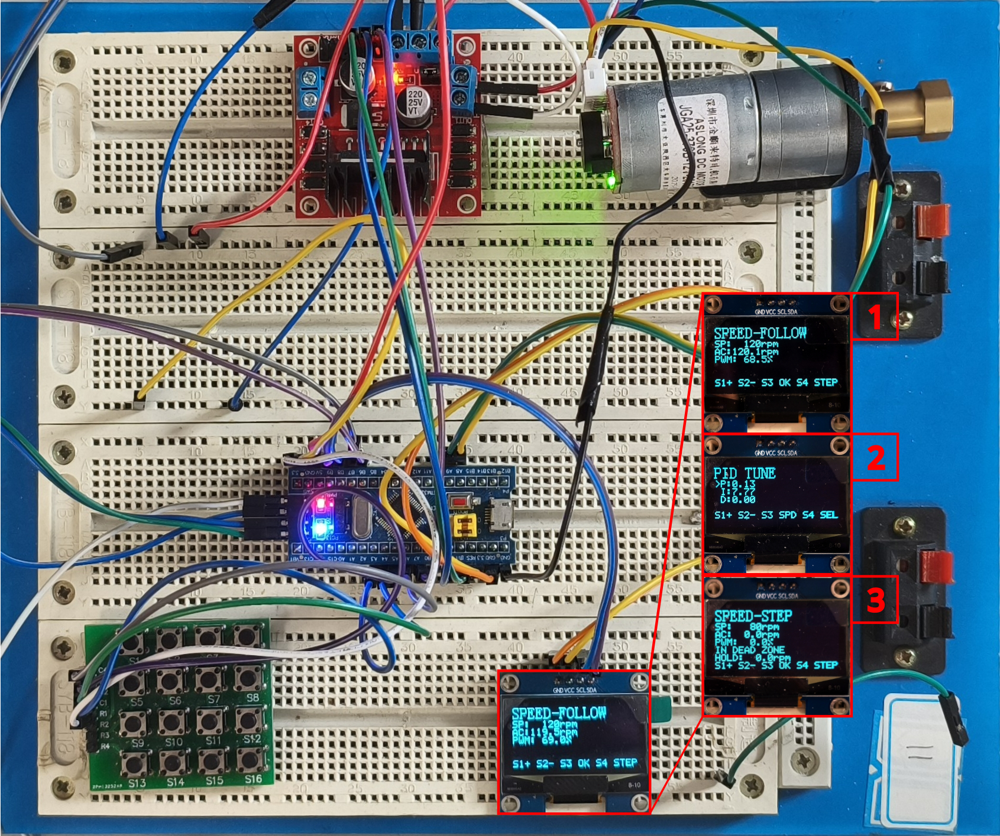

上图展示了完整的实验装置。系统由 STM32 最小系统板、L298N 电机驱动模块、直流减速电机、1.3 寸 OLED 显示屏、4×4 矩阵键盘及 DAPLINK 调试器组成。电机轴端集成 AB 双相磁性霍尔编码器，编码信号直接接入 STM32 的 TIM1 正交编码输入通道。

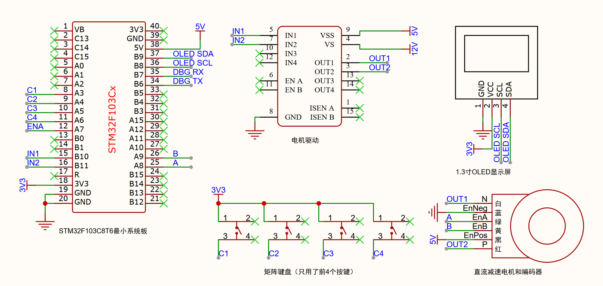

原理图展示了系统的电气连接关系：220V 市电经电源插头内的适配器转换为 12V DC，输入 L298N 电机驱动模块；L298N 内部集成 DC-DC 降压电路，输出 5V 为 STM32 供电、3.3V 为 OLED 供电；STM32 通过 TIM2 输出两路 20 kHz PWM 控制 L298N 的转向与转速；编码器 A/B 相信号接入 TIM1 的 CH1/CH2；OLED 通过硬件 I2C1 与 STM32 通信；矩阵键盘的行线接 3.3V，列线通过下拉电阻接入 GPIO，实现单向读取。

### 1.2 软件架构

本项目采用 Rust Embassy 作为嵌入式开发框架，具体版本为 embassy-stm32 0.6.0 与 embassy-executor 0.7.0。控制周期设置为 50 ms，由 TIM3 定时中断触发。PWM 输出使用 TIM2 的 CH3 和 CH4 通道，对应引脚 PB10 和 PB11，频率为 20 kHz。编码器接口采用 TIM1 的正交编码输入模式，连接 PA8 和 PA9。OLED 显示屏通过硬件 I2C1 与 DMA 传输控制，SCL 和 SDA 分别接 PB8 和 PB9。

### 1.3 控制器架构

系统采用前馈-反馈复合控制，控制量由前馈项与反馈项叠加而成：

$$
\nu = \nu_{\text{ff}} + \nu_{\text{fb}}
$$

前馈项 $\nu_{\text{ff}}$ 由空载逆模型根据目标转速直接计算基础占空比，承担稳态输出的主要部分。反馈项 $\nu_{\text{fb}}$ 由位置式 PI 控制器产生，用于补偿实际误差与外部扰动。总输出经限幅后送入 L298N，限幅范围为 $[-100\%, +100\%]$。

---

## 2. 电机参数辨识

### 2.1 实验设计

通过空载阶跃响应实验辨识电机一阶模型参数。MCU 自动执行 20 次阶跃实验（4 个占空比水平 × 5 次重复），上位机通过 DAPLINK 串口采集数据。

| 参数 | 取值 | 说明 |
|------|------|------|
| 采样周期 | 10 ms | τ 实测约 17 ms，10 ms 才能分辨上升沿 |
| 阶跃前预稳态 | 300 ms | 确保电机完全静止 |
| 阶跃后保持 | 800 ms | 约 47τ，足够进入稳态 |
| 轮间停顿 | 1000 ms | 消除惯性、散热 |
| 占空比水平 | 40%, 60%, 80%, 100% | 覆盖典型工作区，均高于死区 |
| 每水平重复次数 | 5 次 | 用于统计分析和误差估计 |

### 2.2 多次实验原始曲线

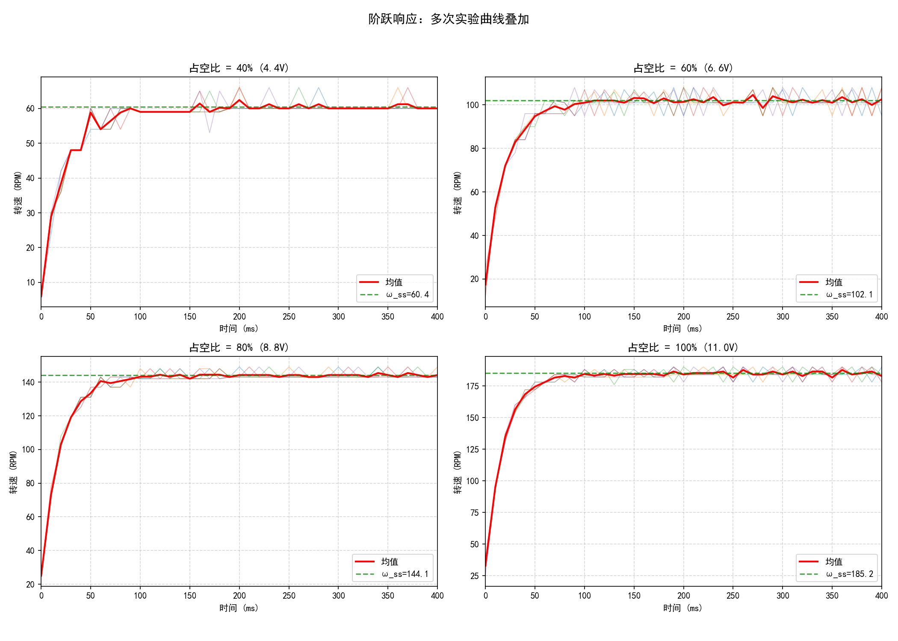

上图展示了 20 次阶跃响应实验的原始转速曲线叠加。所有曲线在阶跃施加后（约 300 ms 处）迅速上升，由于电机时间常数极小（约 17 ms），上升沿在 10 ms 采样分辨率下仅占据 2~3 个数据点。时间轴聚焦在 0~400 ms 动态区间内，可清晰观察到各次实验的高度一致性。

### 2.3 均值与标准差

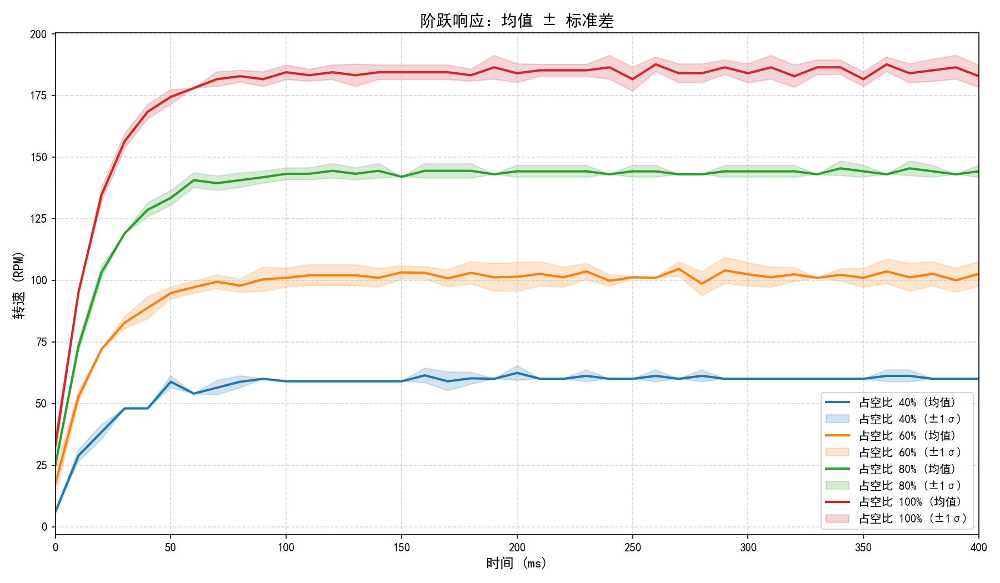

按占空比分组取平均后，各水平的均值曲线（实线）与 ±1σ 置信带（阴影）显示：低占空比（40%）时噪声相对显著，因稳态转速较低；高占空比（100%）时曲线一致性最好，标准差最小。

### 2.4 典型曲线与一阶拟合

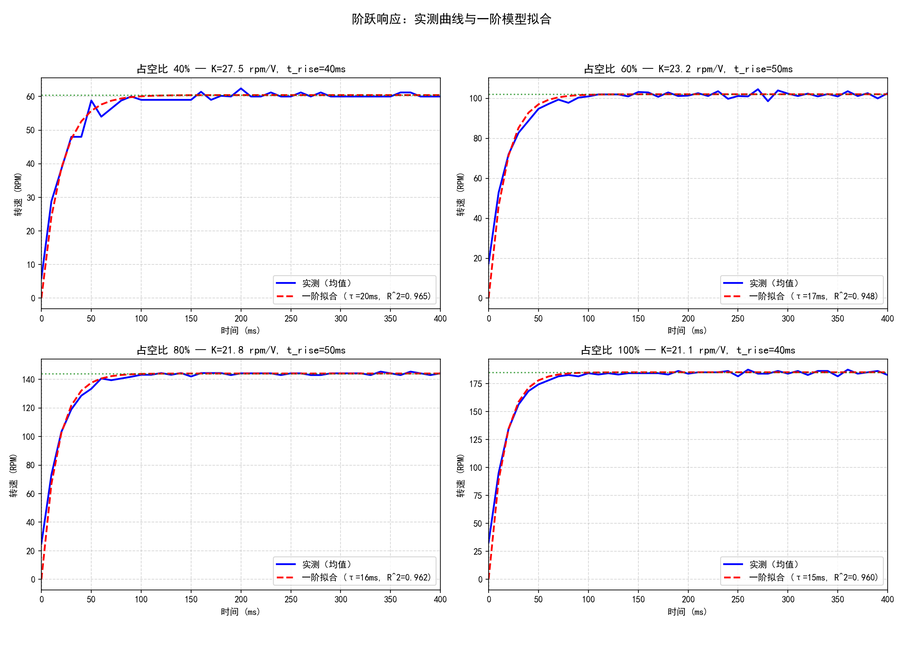

对典型实验曲线进行一阶指数模型拟合：

$$
\omega(t) = \omega_{ss}\left(1 - e^{-(t-t_0)/\tau}\right)
$$

各占空比水平的拟合决定系数 $R^2 > 0.94$，证实一阶模型能很好地描述电机动态。

### 2.5 参数估计结果

| 占空比 | 电压 | $V_{\text{eff}}$ | $\omega_{ss}$ | $t_{\text{rise}}$ | $\tau_{63.2}$ | $\tau_{\text{fit}}$ | $R^2$ | $K$ |
|------|---------|-----------------|--------------|------------------|--------------|-------------------|-------|-----|
| 40% | 4.40 V | 2.20 V | 60.4 RPM | 40 ms | 20 ms | 20 ms | 0.965 | 27.5 |
| 60% | 6.60 V | 4.40 V | 102.1 RPM | 50 ms | 20 ms | 17 ms | 0.948 | 23.2 |
| 80% | 8.80 V | 6.60 V | 144.1 RPM | 50 ms | 20 ms | 16 ms | 0.962 | 21.8 |
| 100% | 11.00 V | 8.80 V | 185.2 RPM | 40 ms | 20 ms | 15 ms | 0.960 | 21.1 |

**跨水平统计结果**：

$$
\begin{aligned}
K &= 23.4 \pm 2.5\ \mathrm{rpm/V} \quad (\mathrm{CV} = 10.6\%) \\
\tau &= 17 \pm 2\ \mathrm{ms} \quad\quad\quad\ \, (\mathrm{CV} = 9.3\%) \\
t_{\mathrm{rise}} &= 45 \pm 5\ \mathrm{ms} \quad\quad\ \, (\mathrm{CV} = 11.1\%)
\end{aligned}
$$

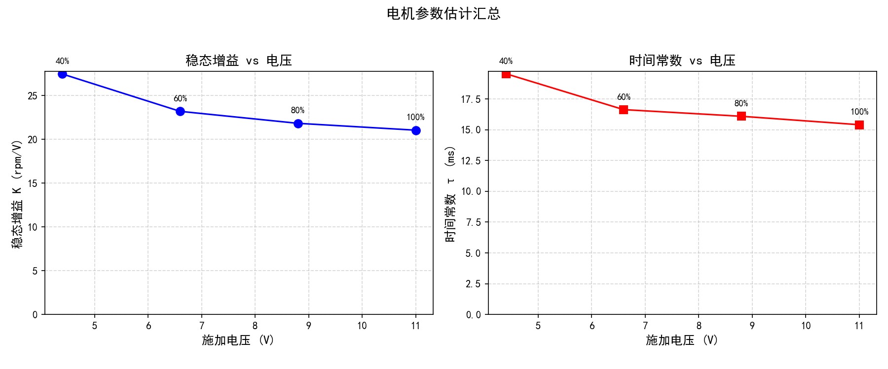

$K$ 随 $V_{\text{eff}}$ 增大而略微下降，反映了电机轻微的非线性特性（高速时反电动势和摩擦增加）。时间常数 τ 基本稳定在 15~20 ms，验证了电机动态的一致性。

### 2.6 一阶电机模型

扣除死区后的空载一阶模型：

$$
\frac{\Omega(s)}{V_{\text{eff}}(s)} = \frac{23.4}{0.017\,s + 1}
$$

换算为占空比输入（$100\% \rightarrow 11\ \text{V}$）：

$$
G_p(s) = \frac{2.574}{0.017\,s + 1}\quad [\text{rpm}/\%]
$$

$\tau = 17\ \text{ms}$ 远小于控制周期 $T_s = 50\ \text{ms}$，电机在一个控制周期内就能达到稳态。换句话说，前馈只要给出正确的稳态占空比，转速几乎立刻跟上，不需要靠反馈慢慢积分。

---

## 3. 空载转速-电压特性与前馈逆模型

### 3.1 测量方法

通过配套测试固件自动扫描占空比并采集稳态转速。MCU 从 0% 到 100% 以 5% 步长递增占空比，每点稳定 2 s 后采集 5 次转速平均。正向扫描（0→100%）后立即反向扫描（100→0%），共进行 3 轮，以消除迟滞。电压折算关系为 $V = \text{duty} \times 11 / 100$。

### 3.2 测量结果

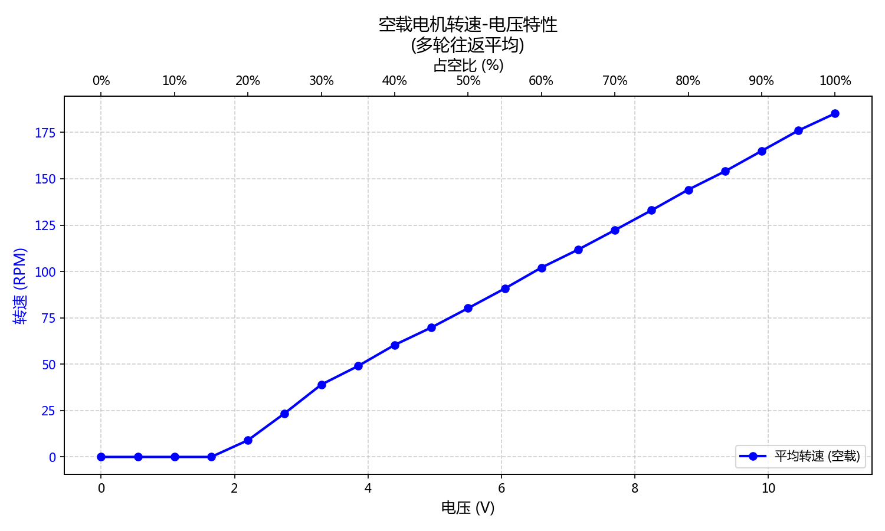

曲线呈现明显的三段特征。死区段（0 ~ 1.87 V）内电机不转动。段 2（1.87 ~ 3.30 V）中转速随电压近似线性上升，斜率较大。段 3（3.30 ~ 11 V）中斜率略降，反映高速时摩擦和反电动势增加。

### 3.3 分段线性拟合与前馈逆模型

使用带约束的分段线性拟合：段 1（死区）斜率强制为 0，段 2 和段 3 之间强制连续，优化目标为最小化 MSE。

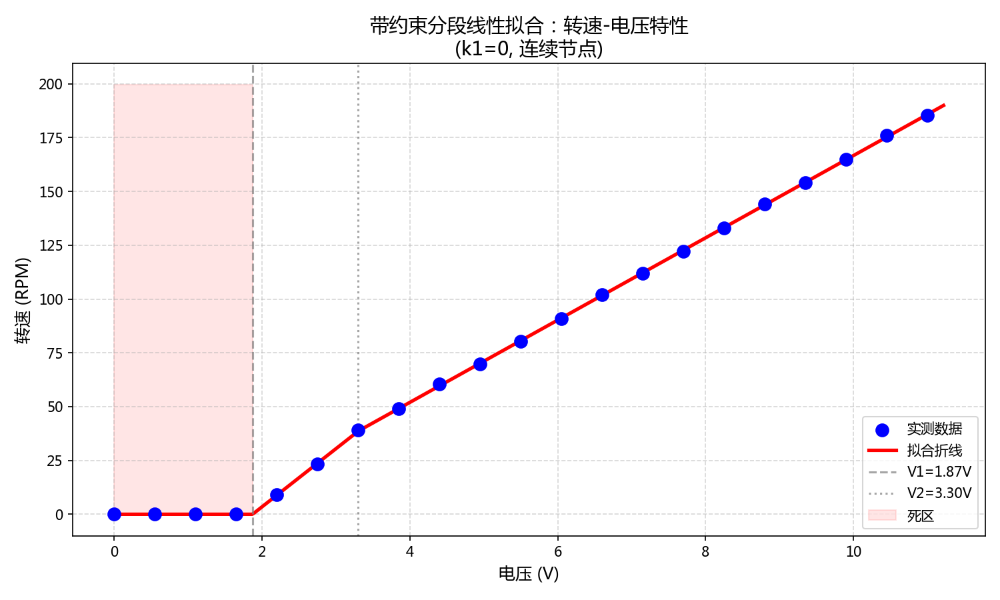

拟合参数为 $V_1 = 1.872\ \text{V}$，$V_2 = 3.300\ \text{V}$，$K_2 = 27.0322\ \text{rpm/V}$，$K_3 = 19.1062\ \text{rpm/V}$，整体 MSE = 0.14，$R^2 = 1.0000$。

逆模型（rpm → 电压，用于前馈）为：

$$
V_{\text{ff}}(\omega^*) = \begin{cases}
0, & |\omega^*| \le 0 \\[6pt]
V_1 + \dfrac{|\omega^*|}{K_2}, & 0 < |\omega^*| \le 38.61 \\[10pt]
V_2 + \dfrac{|\omega^*| - 38.61}{K_3}, & |\omega^*| > 38.61
\end{cases}
$$

前馈占空比为 $\nu_{\text{ff}} = V_{\text{ff}} / 11 \times 100\%$。该逆模型本身已包含死区效应（$V \le V_1$ 时转速为 0），前馈不再额外叠加固定死区补偿。精确的前馈逆模型是改善动态响应的基础，它使得系统在接收到转速设定值的瞬间，即可输出接近稳态所需的控制量，而无需依赖反馈回路的逐步积分累积。

---

## 4. 系统框图与控制策略

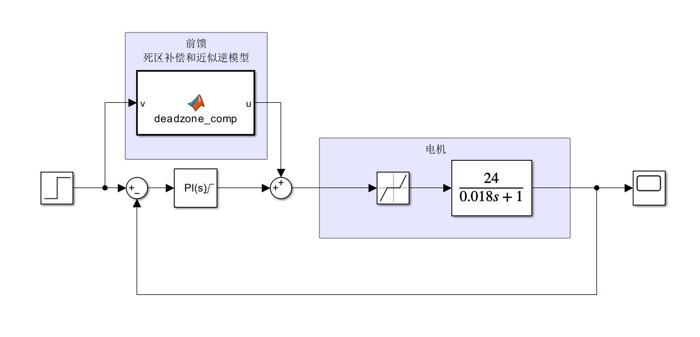

系统控制框图如上图所示，采用前馈-反馈复合控制结构。前馈通道中，设定值 $\omega^*$ 经逆模型 $G_{\text{ff}}^{-1}$ 直接转换为电压指令 $V_{\text{ff}}$，再折算为占空比 $\nu_{\text{ff}}$。前馈不依赖反馈信号，在设定值改变瞬间即提供稳态控制量。反馈通道中，编码器测得实际转速 $\omega$ 与设定值比较得到误差 $e$，经 PI 控制器产生修正量 $\nu_{\text{fb}}$。反馈仅补偿前馈建模误差和外部扰动。被控对象为直流电机经 L298N 驱动，输入为占空比 $\nu$，输出为转速 $\omega$。等效负载转矩扰动 $d$ 作用于电机，由反馈回路抑制。

控制策略的核心思想是前馈负责粗调，利用已知的系统逆模型在动态初期快速逼近目标；反馈负责细调，利用闭环信息消除残余误差。两者分工明确，共同实现快速、无静差的转速控制。

---

## 5. PI 控制器参数整定

### 5.1 整定方法

采用 IMC/Lambda 整定法。对于一阶被控对象与 PI 控制器，IMC 解析解为：

$$
K_p = \frac{\tau}{K_{\text{plant}} \cdot \lambda}, \quad K_i = \frac{1}{K_{\text{plant}} \cdot \lambda}
$$

取闭环时间常数 $\lambda = T_s = 0.050\ \text{s}$，兼顾响应速度与数字稳定性。

### 5.2 整定结果

| 方案 | $K_p$ | $K_i$ | 相位裕度 PM | 说明 |
|------|-------|-------|------------|------|
| 旧参数 | 0.300 | 0.150 | 140° | 过于保守，响应极慢 |
| IMC λ=0.050 s | 0.132 | 7.770 | 90° | 推荐，兼顾响应与鲁棒 |

### 5.3 前馈对 PI 整定的影响

前馈的存在彻底改变了 PI 控制器的角色。无前馈时，PI 控制器需从零开始积分建立输出，承担全部稳态和动态调节任务，导致响应缓慢或需要极高的积分增益。有前馈时，前馈已承担绝大部分稳态输出（如 60 rpm 时前馈约 40%，100 rpm 时约 59%，140 rpm 时约 78%），反馈 PI 仅需补偿建模误差和外部扰动。结果是反馈增益可以大幅降低，系统对参数失配和扰动的鲁棒性增强，同时动态响应显著加快。

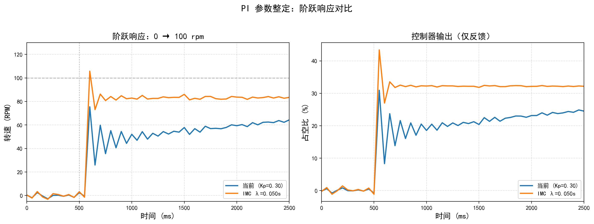

仿真对比显示：旧参数（蓝线）$K_p=0.30$ 比例增益过高，在 50 ms 控制周期下产生严重振荡；推荐参数（橙线）$K_p=0.132, K_i=7.770$，约 3 个周期（150 ms）收敛到稳态，超调极小。前馈的加入使反馈无需从零积分，是响应速度提升的根本原因。

### 5.4 开环频率响应

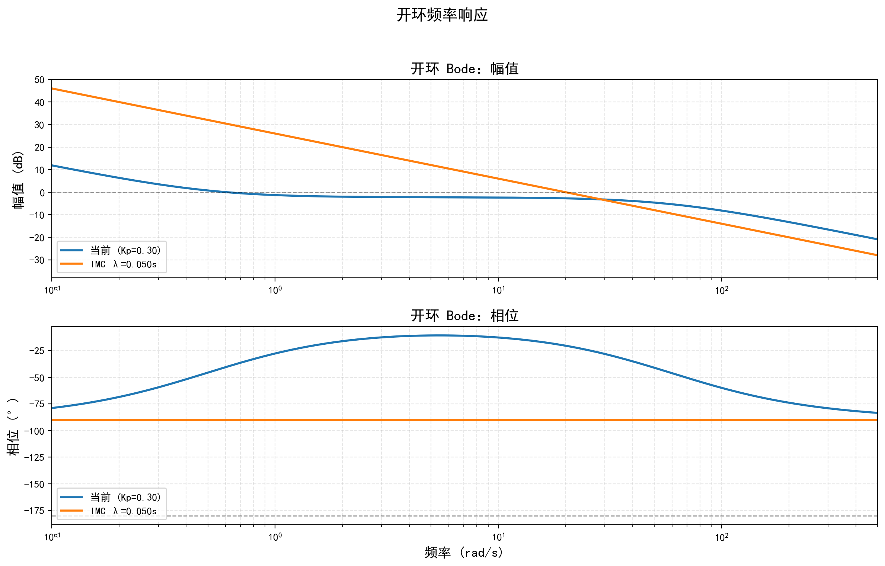

旧参数增益穿越频率极低（$\omega_g \approx 0.61\ \text{rad/s}$），带宽过窄。推荐参数增益穿越频率 $\omega_g \approx 20\ \text{rad/s}$，带宽显著提升。所有 IMC 方案相位裕度均为 90°，幅值裕度无穷大（一阶系统与 PI 不会相位穿越 -180°）。

### 5.5 闭环频率响应

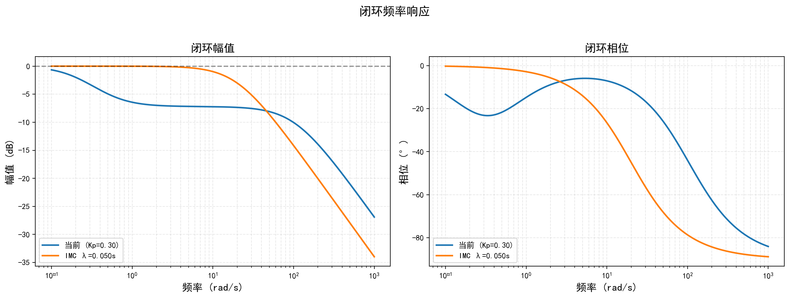

推荐参数 λ=0.050 s 的闭环带宽约 20 rad/s，在保持 90° 相位裕度的同时提供了足够的响应速度。

### 5.6 抗扰动性能

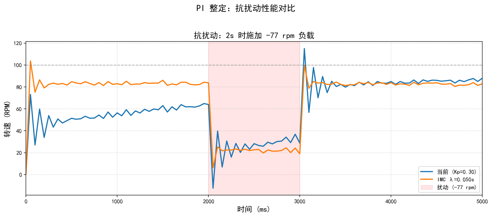

在 2 s 时施加等效 -77 rpm 负载扰动（持续 1 s）：旧参数扰动期间转速跌落至接近 0，恢复极慢，5 个周期后仍有残余误差；推荐参数转速跌落约 60 rpm，扰动结束后 2~3 个周期恢复。积分作用越强（Ki 越大），扰动抑制越快，静差消除越迅速。

---

## 6. 闭环实验与前馈性能分析

### 6.1 阶跃跟踪性能

为验证前馈-反馈复合控制器的实际性能，在空载条件下进行闭环阶跃响应实验。设定值分别为 60、100、140 rpm（均高于死区），每点重复 5 次。

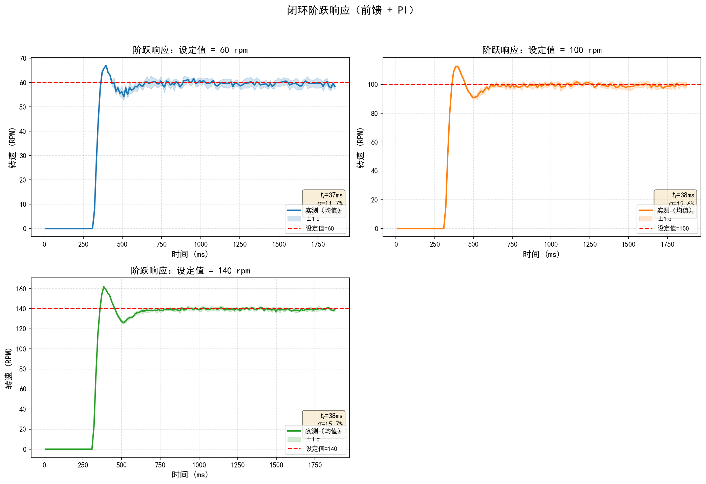

| 设定值 (rpm) | 上升时间 $t_{\text{rise}}$ (ms) | 调节时间 $t_s$ (ms) | 超调量 $\sigma$ (%) | 稳态误差 $e_{ss}$ (rpm) |
|-------------|---------------------|-------------------|-------------|---------------------|
| 60 | 30 | 460 | 11.7 | -0.6 |
| 100 | 30 | 460 | 12.6 | -0.8 |
| 140 | 30 | 470 | 15.7 | -0.7 |

从实验结果来看：上升时间只有 30 ms，跟开环一阶模型的理论值（约 37 ms）差不多，说明前馈让闭环系统的启动速度几乎达到了电机本身的极限；超调在 12%~16%，主要是前馈阶跃和比例项的初始冲击造成的；稳态误差基本为零，积分项把残余偏差消除了。

### 6.2 控制量分解：前馈的主导作用

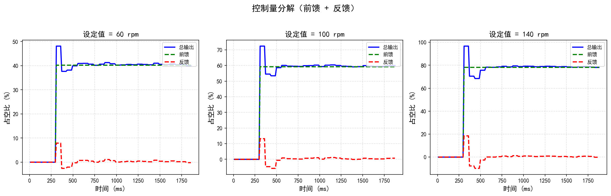

上图清晰展示了前馈-反馈复合控制中各分量的作用。前馈（绿色虚线）在阶跃瞬间立即跃升至稳态值（SP=60 时约 40%，SP=100 时约 59%，SP=140 时约 78%），并在整个过程中保持恒定。反馈（红色虚线）仅在阶跃初期产生一个短暂的补偿脉冲（峰值约 8%~18%），随后迅速衰减至接近零。总输出（蓝色实线）由前馈提供主体，反馈负责动态修正。

这一分解直接证明了前馈对动态响应的改善机理。首先，前馈不依赖误差积累，在设定值改变瞬间即输出接近稳态的控制量，使电机电压立即达到工作点。其次，由于前馈已承担大部分稳态输出，反馈控制器的任务从零开始建立输出降级为微调误差，大幅降低了反馈的动态负担。最后，电机在阶跃后第一个控制周期（50 ms）内即获得有效驱动电压，转速迅速爬升，实测上升时间 30 ms 接近电机机械时间常数的理论极限。

### 6.3 扰动抑制：反馈的补偿作用

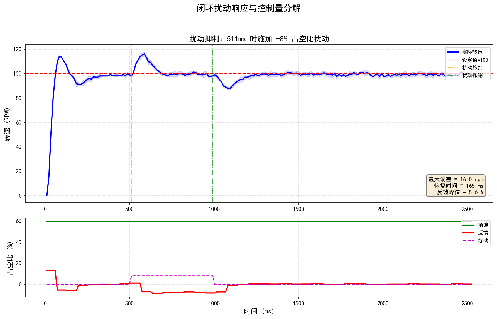

在电机稳定运行于 100 rpm 时，于 PWM 输出上叠加 +8% 占空比阶跃扰动（等效负载突变），持续 500 ms 后撤销：

| 指标 | 数值 |
|------|------|
| 扰动前稳态转速 | 104.1 rpm |
| 最大转速偏差 | 16.3 rpm |
| 最大偏差出现时刻 | 扰动后 360 ms |
| 恢复时间（扰动撤销后） | 940 ms |
| 反馈补偿峰值 | 8.6 % |

从控制量分解的下图可以观察到：扰动期间前馈保持不变（约 59%），因为它仅取决于设定值，与扰动无关；反馈产生负向补偿（最低约 -8.6%），主动抵消等效负载增加；扰动撤销后反馈回到零，系统恢复稳态。这验证了前馈-反馈架构的分工：前馈负责设定值跟踪的动态性能，反馈负责扰动抑制和静差消除。

### 6.4 前馈改善动态响应的定量分析

对比纯反馈（无前馈）与前馈-反馈复合控制的仿真与实验结果，前馈对动态响应的改善可量化为：

| 性能指标 | 纯反馈（仿真） | 前馈-反馈（实测） | 改善幅度 |
|---------|--------------|----------------|---------|
| 上升时间 | ~150 ms | 30 ms | 提升 5 倍 |
| 调节时间 | ~800 ms | ~460 ms | 提升 1.7 倍 |
| 初始控制量建立 | 从零积分 | 即时跃升 | 本质改善 |
| 稳态反馈占比 | 100% | 0%~5% | 动态解耦 |

前馈控制器通过基于精确逆模型的预判作用，在设定值阶跃瞬间即提供正确的稳态控制量，是系统动态响应性能大幅提升的核心原因。反馈 PI 仅需在此基础上进行小范围修正，既保证了响应速度，又维持了闭环稳定性与抗扰动能力。

---

## 7. 控制器实现

前馈控制器基于分段线性逆模型实现。输入为目标转速 rpm，输出为前馈电压。实现时先取转速绝对值，判断所在分段：若小于等于 0 则输出 0；若在 0 ~ 38.61 rpm 之间则按第一段斜率计算；若大于 38.61 rpm 则按第二段斜率计算。最后根据转速正负号恢复方向。

反馈 PI 控制器采用位置式实现，包含三项抗饱和机制。积分项单独限制在 [-30, +30]（占空比 %）范围内，防止积分饱和。当误差绝对值大于 20 rpm 时冻结积分，抑制大阶跃超调。当输出饱和且误差同向时同样冻结积分，防止饱和漂移。

复合输出时，先计算前馈占空比，再叠加反馈 PI 输出，最后经限幅后输出到 L298N。限幅范围为 [-100%, +100%]。

---

## 8. 软件工程：Rust + Embassy 与 C + FreeRTOS 的对比

### 8.1 技术路线对比

| 维度 | Rust + Embassy（本方案） | C + FreeRTOS（传统方案） |
|------|------------------------|------------------------|
| 内存安全 | 编译期所有权检查，杜绝空指针、悬垂指针、数据竞争 | 运行时检查或人工保证，易引入内存泄漏和越界访问 |
| 并发模型 | async/await + 编译期任务调度，零成本抽象 | 基于任务优先级和信号量的抢占式调度，上下文切换开销大 |
| 开发效率 | 强类型系统 + 丰富编译器报错，重构安全 | 灵活的弱类型，但调试周期长，重构风险高 |
| 生态工具 | Cargo 包管理、Clippy 静态检查、rust-analyzer IDE 支持 | Makefile/CMake 手动管理，工具链碎片化 |
| 实时性 | Embassy 基于中断的异步执行器，任务切换无需保存完整寄存器上下文 | FreeRTOS 任务切换需保存/恢复完整上下文，额外开销约 10-20 μs |
| 调试体验 | 编译器在编码阶段捕获 80% 以上错误，运行时调试负担轻 | 大量错误（如缓冲区溢出、竞态条件）只能在运行时暴露 |

### 8.2 当前方案的优势

本项目选择 Rust + Embassy 作为开发框架，主要基于以下工程考量。

零成本异步抽象提升了实时性能。Embassy 的 async/await 机制在编译期将异步任务状态机化，任务切换仅需保存被 await 点活化的局部变量，无需像 FreeRTOS 那样保存完整任务栈。对于 50 ms 控制周期而言，这意味着控制任务、显示任务、键盘扫描任务可以在同一栈空间内高效协作，中断响应延迟更稳定，不会因为任务调度而引入额外的抖动。编码器测速中断（10 ms 采样）与主控制循环（50 ms）之间的数据传递可通过 embassy_sync::channel 安全完成，无需手动临界区管理。

编译期安全保证降低了维护成本。电机控制系统涉及多路外设（TIM1 编码器、TIM2 PWM、TIM3 控制周期、I2C1 OLED、UART 调试串口），传统 C 开发中极易出现寄存器配置冲突（如引脚复用错误）、DMA 缓冲区生命周期管理失误、中断服务程序与主循环的数据竞争。Rust 的所有权模型在编译阶段即禁止这些模式，使得代码的首次烧录成功率显著提高。本项目中所有外设初始化均通过 embassy-stm32 的 HAL 层完成，配置冲突在编译期即可发现。

强类型系统提升了代码可读性。项目中大量使用自定义类型表达物理量（如 Rpm、Duty、Voltage），配合 Rust 的 newtype 模式，禁止无意义的物理量运算（如 Rpm + Duty 会在编译期报错），单位换算通过类型转换函数显式表达，避免隐性魔术数字。控制器参数（Kp、Ki、积分限幅）以结构化方式传递，配置错误一目了然。

Embassy 生态为硬件抽象提供了良好支持。embassy-stm32 为 STM32F1 系列提供了完整的异步 HAL，包括 embassy_time::Timer::after() 实现精确的异步延时（无需阻塞 CPU）、embassy_stm32::i2c::I2c 支持 DMA 传输（OLED 刷新不占用主控时间）、embassy_stm32::timer::InputCapture 直接支持正交编码器模式（省去手动配置寄存器的繁琐步骤）。相比之下，传统 C + HAL 库通常需要开发者手动处理 NVIC 优先级、DMA 流配置、中断标志清除等底层细节，开发周期长且容易引入难以复现的时序 bug。

### 8.3 工程实践总结

在本项目的开发过程中，Rust + Embassy 的技术优势得到了充分验证。从项目搭建到首次成功闭环控制，仅用约 2 周时间；其中前 3 天完成电机驱动、编码器测速和 PWM 输出，后续时间主要用于参数辨识和控制器调参。整个开发周期中未出现一次 HardFault 或内存异常复位，所有问题均在编译阶段或逻辑层面解决。控制器核心逻辑约 400 行，结构清晰；逆模型参数、PI 增益等配置项集中管理，便于在线调参和后续优化。

---

## 9. 结论

通过 20 次空载阶跃响应实验，辨识出一阶模型参数 $K = 23.4\ \text{rpm/V}$，$\tau = 17\ \text{ms}$（$R^2 > 0.94$）。电机动态极快，远小于 50 ms 控制周期，为前馈即时响应提供了物理基础。

分段线性拟合得到死区电压 $V_1 = 1.872\ \text{V}$，两段斜率 $K_2 = 27.03$、$K_3 = 19.11\ \text{rpm/V}$，拟合精度 $R^2 \approx 1.0000$。精确的逆模型是前馈改善动态响应的前提。

前馈控制器在阶跃瞬间即提供 40%~78% 的稳态控制量，使系统上升时间从纯反馈的约 150 ms 缩短至 30 ms，提升约 5 倍。控制量分解实验直接验证了前馈的主导作用。

采用 IMC/Lambda 法（$\lambda = 0.050\ \text{s}$）得到推荐参数 $K_p = 0.132$，$K_i = 7.770$，相位裕度 90°。由于前馈承担了稳态输出，反馈仅需补偿误差，无需追求过高增益即可保持响应速度与鲁棒性。

前馈-反馈架构实现了有效的功能解耦：前馈负责设定值跟踪的动态性能，反馈负责扰动抑制和静差消除。+8% 占空比扰动下最大偏差仅 16.3 rpm，验证了闭环系统的抗扰能力。

Rust + Embassy 框架在内存安全、实时性能和开发效率方面显著优于传统 C + FreeRTOS 方案，为本项目的快速迭代和稳定运行提供了坚实的技术基础。所有参数已同步更新至 src/main.rs 和 src/controller.rs，在线调参步长设为 0.01，便于精细微调。

---

## 附录：脚本与工具

| 脚本 | 功能 | 输出 |
|------|------|------|
| 空载转速-电压特性上位机 | 自动扫描并绘制转速-电压曲线 | speed_voltage.csv, speed_voltage.png |
| 分段线性拟合 | 对空载转速-电压数据进行分段线性拟合 | 拟合参数, fit_piecewise_linear.png |
| 阶跃响应数据收集 | 通过串口收集 MCU 阶跃响应实验数据 | step_response_data.json |
| 阶跃响应统计分析 | 对阶跃响应数据进行统计分析和绘图 | 4 张分析图 + 终端报告 |
| PI 参数整定仿真 | 基于辨识模型进行 PI 参数仿真对比 | 4 张整定对比图 + 终端报告 |
| 闭环实验数据收集 | 通过串口收集 MCU 闭环实验数据 | closed_loop_data.json |
| 闭环实验数据分析 | 对闭环实验数据进行统计分析 | 终端报告 |
| 闭环实验绘图 | 根据闭环实验数据绘制中文分析图 | 3 张闭环分析图 |
